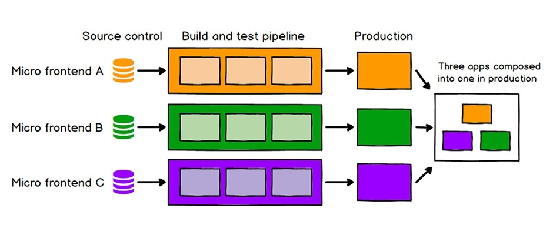
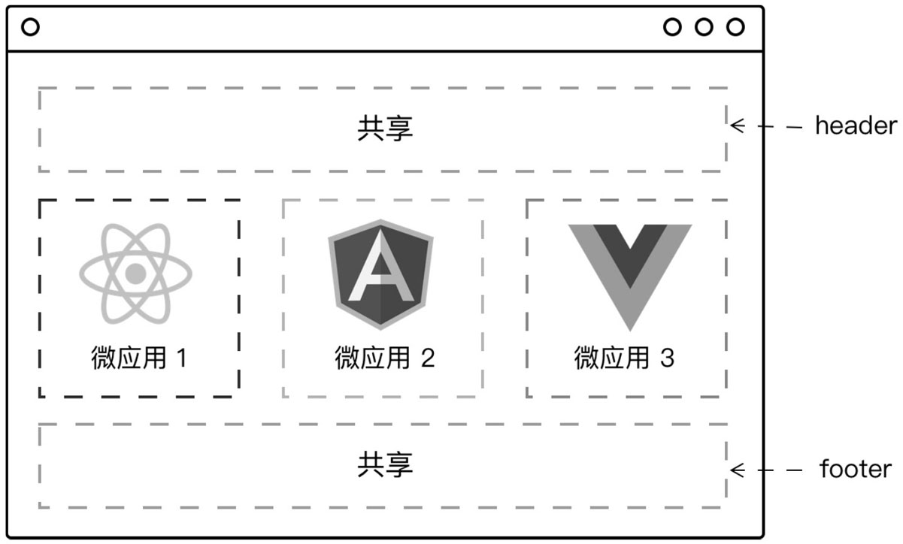
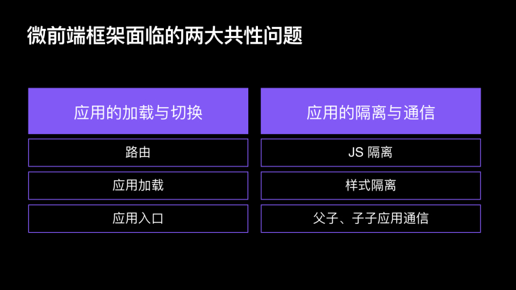

微前端架构，即是把单一的 <b>单页面应用</b> 转变为把多个 <b>小型前端应用</b> 聚合为一的应用。各个前端应用可以独立开发、独立部署、应用自治。

<!-- more -->

## 概述

微前端架构，即是把单一的 <b>单页面应用</b> 转变为把多个 <b>小型前端应用</b> 聚合为一的应用。各个前端应用可以独立开发、独立部署、应用自治。



简单的来说，微前端将多个项目聚合到一个项目中展示。



## 何时需要微前端

1. 遗留系统迁移。遗留系统技术栈较旧但是添加新服务时就想用新的技术栈
2. 聚合前端应用，将多个系统整合到一个系统中
3. 大应用拆分，将一个大的应用拆分为多个子应用并聚合

## 微前端的好处

1. 技术无关。每个开发团队自行选择技术栈，不收其他团队影响
2. 业务独立。 每个交付产物可以独立使用，避免和其他交付产物耦合
3. 样式隔离。项目之间的样式不会互相影响
4. 原生支持。最好使用原生事件通信。比较难达到

## 微前端框架共性问题

微前端框架面临两大共性问题，当你解决完图中这两大共性问题时，基本上你的微前端框架就基本可用了



## 架构模式

1. 基座模式。一个主应用来管理其他应用；维护应用注册表。常用，且相对容易实施
2. 自组织模式。所有应用平级。由于要互相唤醒，所有每个应用其实都带有一定的基座功能

## single-spa

> Single-spa 是一个将多个单页面应用聚合为一个整体应用的 javascript <b>微前端框架</b>

[传送门](https://zh-hans.single-spa.js.org/docs/getting-started-overview/)

<b>single-spa</b>提供了三种微前端的类型

1. applications:为一组特定路由渲染组件的微前端 <b>应用级</b>
2. parcels: 不受路由控制，渲染组件的微前端 <b>组件级 没有路由的概念</b>
3. utility modules: 非渲染组件，用于暴露共享 javascript 逻辑的微前端

<b>single-spa</b>虽然是社区比较早的微前端实现方案，但是它目前只是实现了关于路由的劫持，可以通过路由来加载对应的应用，但
是没有做到应用之间的隔离（JS 隔离，样式隔离）以及应用之间的通信问题，这些都是我们需要再在其基础上进行拓展的

<b>single-spa</b>规定了应用接入的形式，只需要你的应用实现`bootstrap`, `mount`, `unmount`三个生命周期函数并导出，框架就可
以知道如何去加载当前这个子应用

这三个钩子就是子应用的生命周期函数，当子应用第一次挂载的时候，会执行`bootstrap`的初始化操作，然后执行`mount`进行挂载，
在`vue`中，你就可以将当前实例挂载到页面容器上，当应用切换时，会执行`unmount`把应用卸载掉

```js
export function boostrap() {} // 应用初始化，只在子应用第一次加载时触发

export function mount() {} // 挂载应用

export function unmount() {} // 卸载应用
```

## 类 single-spa

<b>single-spa</b>提供的更多是思考和实践，但是对于<b>single-spa</b>目前存在的缺陷，为了更方便的实现开箱即用，已有其他团队
基于<b>single-spa</b>进行封装和扩展

1. [qiankun](https://qiankun.umijs.org/zh/guide)
2. [icestark](https://github.com/ice-lab/icestark)

对于 qiankun 的文档我不再过多赘述，请移步到此处[传送门](https://www.yuque.com/zaotalk/posts/dfqyh7#SSO4y)

## 参考链接

1. [实施微前端的六种方式](https://juejin.im/post/6844903636774961165)
2. [微前端在小米的实践](https://xiaomi-info.github.io/2020/04/14/fe-microfrontends-practice/)
3. [万字长文+图文并茂+全面解析 qiankun 源码](https://www.jianshu.com/p/db08174fa4fc)