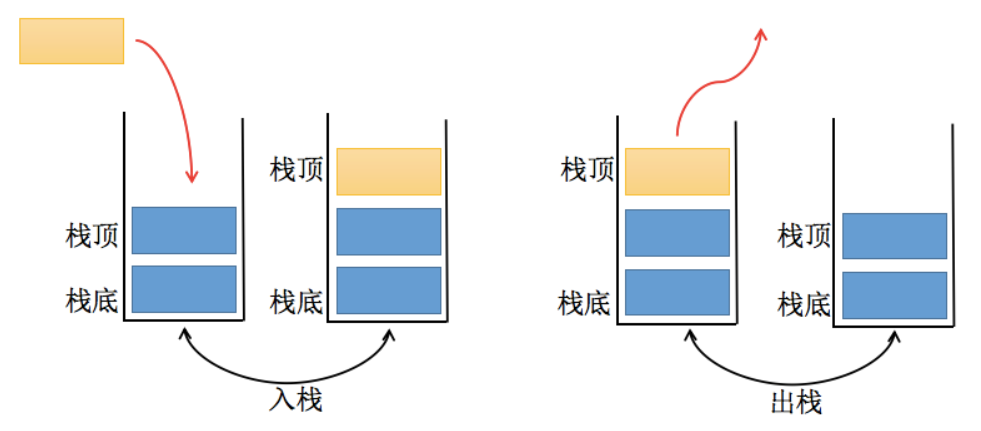

## 栈结构（Stack）

数组是一个线性结构，并且可以在数组的任意位置插入和删除元素。而栈和队列就是比较常见的受限的线性结构。

如下图所示



## 方法

1. push：添加一个新元素到栈顶位置；
2. pop：移除栈顶的元素，同时返回被移除的元素；
3. peek：返回栈顶的元素，不对栈做任何修改
4. isEmpty：如果栈里没有任何元素就返回true，否则返回false；
5. size：返回栈里的元素个数。这个方法和数组的length属性类似；
6. toString：将栈结构的内容以字符串的形式返回。

代码实现

```js
class Stack {
    constructor() {
        this.stack = [];
    }

    push(element) {
        this.stack.push(element)
    }

    pop() {
        return this.stack.pop();
    }

    peek() {
        return this.stack[this.size() - 1]
    }

    isEmpty() {
        return this.stack.length === 0;
    }

    size() {
        return this.stack.length;
    }

    toString() {
        let str = ``;
        for (let i = 0; i < this.stack.length; i++) {
            str += this.stack[i] + ' ';
        }
        return str;
    }
}