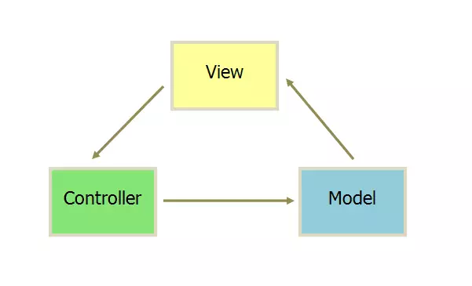
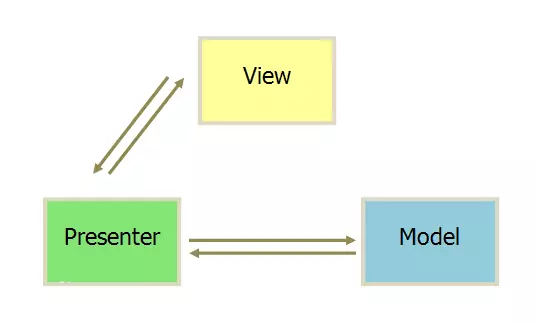

## vue 框架

vue 是一个构造函数，是一个类，它是单例模式

## mvvm && mvc && mvp

`mvc`: `Model-View-Controller`简称`mvc`



`mvvm`:`Model-View-ViewModel`简称`mvvm`


`mvp`: `Model-View-Presenter`简称`mvp`



## 生命周期

```api
beforeCreate            
created
beforeMount
mounted
beforeUpdate
updated
beforeDestroy
destroyed

// keep-alive 模式下
activated
deactivated
```

## v-if & v-show && v-for

v-if 是条件渲染，只有符合条件，才会在dom树上显示dom

v-show 是css display状态切换，元素始终会在dom上显示

v-for 与 v-if 一起使用时，v-for的优先级更高，避免在同层使用

## computed & watch & methods

## 组件之间通信

## keep-alive

## vnode

## vue 如何实现双向数据绑定

## 如何优化vue项目的加载速度

