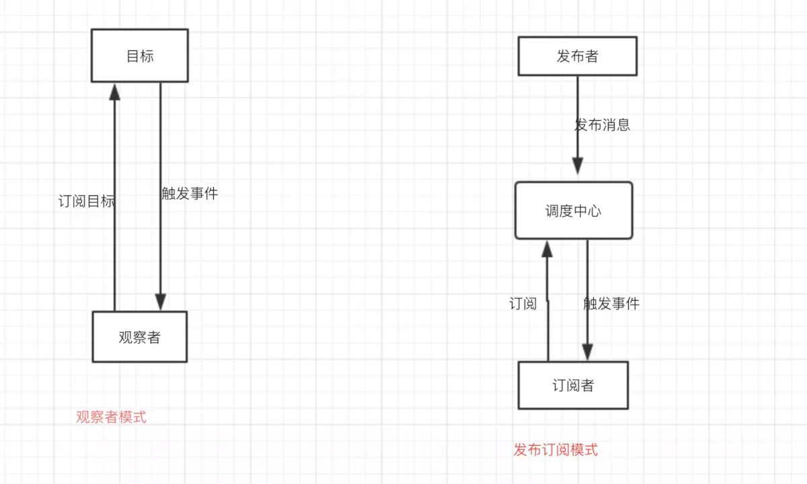

双向绑定用到的技术：

1. Object.definePrototype
2. 发布订阅模式

## Object.definePrototype

修改对象的属性，并返回该对象

语法

```js
Object.definePrototype(target, prop, desc);

`target`: 目标对象
`prop`: 操作属性
`desc`: 描述
{
    value: 设置当前属性值 undefined
    writeable: 可写 false
    configurable: 可删 false
    enumerable: 是否在枚举中 false
    get: 读取值
    set: 设置值
}
```

## 发布订阅模式

1. 发布订阅

订阅者， 发布者， 中间人（中间对象）

2. 观察者模式

观察者， 目标

具体区别如下图



3. 订阅发布实现

```js
// 发布订阅模式（Publisher && Subscribe）
// 订阅者（Subscriber）把自己想订阅的事件注册（Subscribe）到调度中心（Topic），
// 当发布者（Publisher）发布该事件（Publish topic）到调度中心，也就是该事件触发时，由调度中心统一调度（Fire Event）订阅者注册到调度中心的处理代码。

class PubSub {
    constructor() {
        this.subs = [];
    }
    
    // 订阅一个事件
    subscribe(key, fn) {
        if (!this.subs[key]) {
            this.subs[key] = [];
        }
        this.subs[key].push(fn);
    }

    // 发布
    publish() {
        let args = [...arguments];
        let key = args.shift();

        let fns = this.subs[key];

        if (!fns || fns.length <= 0) return;

        for (let i = 0, len = fns.length; i < len; i++) {
            fns[i](args);
        }
    }

    // 卸载事件
    unSubscribe(key) {
        delete this.subs[key]
    }
}
```

4. 观察者实现

```js

// 观察者（Observer）直接订阅（Subscribe）主题（Subject），
// 而当主题被激活的时候，会触发（Fire Event）观察者里的事件

class Subject {
    constructor() {
        this.subLists = [];
    }

    // 添加观察的对象
    add(observer) {
        this.subLists.push(observer)
    }

    remove(observer) {
        this.subLists.filter(item => item == observer);
    }

    notify() {
        this.subLists.forEach(sub => {
            sub.update();
        })
    }
}

class Observer {
    constructor() {
    }

    update(callback) {
        this.callback();
    }
}

```