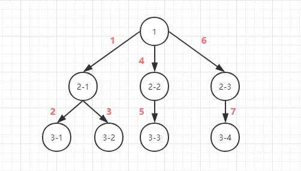
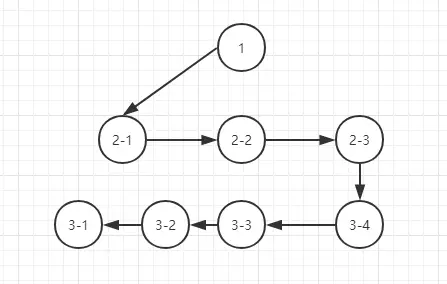

愿所有的梦想都能开出最美的花朵

## JS为什么会出现异步

扩展：

线程：是操作系统能够进行运算调度的最小单位。它被包含在进程之中，是进程中的实际运作单位

进程：进程是一个具有一定独立功能的程序在一个数据集上的一次动态执行的过程

js最初的设计是单线程模式，主要用途是与用户互动，以及操作DOM，单线程是为了保证DOM过程中的唯一性，js代码的执行由上而下解析运行，遇到耗时长的方法会等待其返回再继续向下执行，为了更好的和用户进行交互，引入了事件循环机制，将程序分为同步任务和异步任务，异步任务通常用户处理页面耗时较长且暂时不需要立即执行的函数

虽然js是单线程的，但是浏览器是多线程的，常见的线程有GUI渲染线程，JavaScript解析线程，事件处理线程

异步虽然解决了JS因执行耗时长出现程序运行阻塞问题，但是由于很多时候需要在异步响应后进行对应操作，所以为了更好的处理异步有以下解决方案

1. callback
2. Promise
3. async awiat
4. 发布订阅

## 从输入url的地址栏，到页面展示，这中间发生了什么

```javascript
① DNS 解析，获取到服务器的真实IP地址
② 建立TCP 链接
③ 进行HTTP 三次握手、HTTP四次挥手
④ 解析HTML、CSS 分别为DOM tree 和 css Rule Tree
⑤ 构建出 render tree
⑥ 根据 render tree 进行布局

layout 回流 根据render tree, 进行回流，得到元素节点的几何信息
repaint 根据render tree 以及 layout 得到的几何信息，得到节点的绝对像素
display 将像素发送给GPU，展示在页面上
```

[详细说明](https://www.cnblogs.com/chrislinlin/p/12629820.html)

## 跨域

1. 什么是同源策略

同源策略是浏览器的一种安全策略，限制加载非origin的脚本文件，减少可能被攻击的媒介

2. 同源定义

协议相同；端口相同；主机相同；

3. 跨域的解决方案

```js
1. CORS
可以使用 CORS 来允许跨源访问。CORS 是 HTTP 的一部分，它允许服务端来指定哪些主机可以从这个服务端加载资源。

2. JSONP & jquery jsonp
创建一个script标签，通过src动态向服务器传递参数和callback函数

const request = ({url, data}) => {
   return new Promise((resolve, reject) => {
        let { url, data, jsonpCallback = "callback" } = options;
        let handleDelData = (data) => {
            let keys = Object.keys(data);
            let len = keys.length;
            let pre = '';
            for (let i = 0; i < keys.length; i++) {
                let value = data[keys[i]];
                let flag = i !== len - 1 ? '&' : '';
                pre += `${keys[i]}=${value}${flag}`
            }
            return pre;
        }
        const script = document.createElement("script");
        script.src = `${url}?${handleDelData(data)}&callback=${jsonpCallback}`;
        document.body.appendChild(script);
        window[jsonpCallback] = (res) => {
            document.body.removeChild(script);
            delete window[jsonpCallback];
            resolve(res);
        }
    })
}

3. nginx 转发 proxy_pass
4. document.domain + iframe
5. window.name + iframe
6. postMessage + iframe
7. web sockets
```

## 前端性能优化

1. 减少请求资源大小或者次数

- 尽量和并和压缩css和js文件。（将css文件和并为一个。将js合并为一个）
- 尽量所使用的字体图标或者SVG图标来代替传统png图
- 采用图片的懒加载（延迟加载）
- 避免引入第三方大量的库
- 减少对cookie的使用
- 前端与后端协商，合理使用keep-alive
- 前端与服务器协商，使用响应资源的压缩
- 避免使用iframe

2. 代码优化相关

- 在js中尽量减少闭包的使用（使用闭包后，闭包所在的上下文不会被释放）
- 减少对DOM操作，主要是减少DOM的重绘与回流
- 减少css表达式的使用
- 尽量将一个动画元素单独设置为一个图层
- 使用window.requestAnimationFrame(js的帧动画)代替传统的定时器动画
- 基于script标签下载js文件时，可以使用defer或者async来异步加载

3. 存储

- 结合后端，利用浏览器的缓存技术，做一些缓存
- 利用h5的新特性（localStorage、sessionStorage）做一些简单数据的存储

## js 的基本数据类型有哪些

```js
undefined null Boolean String Number Symbol
Array Object //引用数据类型
```

## 如何判断一个变量是什么类型

```js
typeof 可以判断出 undefined Boolean String Number Symbol
instanceof 运算符用于检测构造函数的 prototype 属性是否出现在某个实例对象的原型链上。 也可以理解为是否为某个对象的实例
也可以理解为是否为某个对象的实例
Object.prototype.toString.call 最合适判断
let isType = type => obj => Object.prototype.toString.call(obj) === '[object ' + type + ']';
```

## 数组常用的操作有哪些，都有什么含义怎么使用

```js
push                // 向数组的末尾添加一个元素，返回当前数组的长度
unshift             // 向数组的头部添加一个元素，返回当前数组的长度
pop                 // 从数组的队尾删除一个元素，并返回该元素
shift               // 从数组的头部删除一个元素，并返回该元素
slice               // 从数组中截取起始位置到结束位置之间的元素，并返回一个新的数组，不改变原数组
splice              // 从数组中截取起始位置到结束位置之间的元素，返回一个新数组，改变原数组，也可以添加数据
sort                // 按照条件进行数组排序，返回改变后的数组
reduce              // 进行数据每一项的叠加(pre // 返回值, currentItem, index, arr), initData // 初始值
forEach             // 遍历数组中的每一项
map                 // 遍历数组的每一项，对数组中的每一项进行条件处理，并返回一个新的数组
filter              // 遍历数组的每一项，对数组的每一项按照条件筛选，返回符合条件的新数组
includes            // 判断数组中是否含有某个值，返回true / false
indexOf             // 判断数组中是否含有某个值，并返回其所在数组的下标值
concat              // 连接两个或者多个数组
find                // 选择符合条件的元素，若有多个元素，则返回第一个匹配的元素
findIndex           // 选择符合元素的下标，则返回第一个匹配元素的下标
entries()           // 将数组转化为键值对的形式 键是index, value是元素
keys()              // 遍历元素的下标
values()            // 遍历元素的值
flat()              // 嵌套数组降维
...                 //扩展运算符
Array.of            // 将参数中的值转化为数组
Array.from          // 将类数组（必须以下标为key，并且有length属性）或者可迭代的对象转化为数组
Array.isArray       // 是否是数组
```
## 数据的拷贝有哪些方式

```js
1. slice        // 只能拷贝不含引用数据类型，浅拷贝
2. JSON.parse(JSON.stringify()) // 完全拷贝
3. 深拷贝
```

## 对象的拷贝有哪些方式

```js
1. Object.assign            // 浅拷贝，拷贝的引用地址
2. JSON.parse(JSON.stringify()) // 深拷贝
3. 深拷贝
```

## 深拷贝实现

```js
function DeepCopy(obj) {
    if (obj == null || typeof obj !== 'object') {
        return obj
    };
    const copy = Array.isArray(obj) ? [] : {};
    Object.keys(obj).forEach(key => {
        copy[key] = DeepCopy(obj[key]);
    })
    return copy;
}
```
## setTimeout Promise async await的区别

setTimeout 是定时器，在事件循环机制中属于宏任务，在指定时间后执行callback函数

Promise 是同步的立即执行函数，只有在执行resolve和reject才是异步任务，属于事件循环机制中的微任务，Promise 拥有三个状态（pedding, resolve, reject），且状态一旦发生改变就会固定下来

async await 是generator 的语法糖， async 返回的是一个promise函数，遇到await 就会先返回await的结果，再继续向下执行，将主线程让出

## call, apply, bind

call、apply、bind的作用是改变函数运行时this的指向

```javascript
Function.prototype.call = function (context) {
    // 参数是...arguments
    context = context || window;
    context.fn = this;
    let result = null;
    let args = [...arguments].slice(1);
    result = context.fn(...args);
    delete context.fn;
    return result;
}

Function.prototype.apply = function (context) {
    // 参数是...arguments
    context = context || window;
    context.fn = this;
    let result = null;
    let args = arguments[1];
    result = context.fn(...args);
    delete context.fn;
    return result;
}

Function.prototype.bind = function (context) {
    // 参数是...arguments
    let self = this;
    let args = [...arguments].slice(1);

    return function () {
        return self.apply(context, args.concat([...arguments]))
    }
}
```

## 偏函数 & 函数柯里化

偏函数(局部应用)是固定一个函数的一个或者多个参数，也就是将一个 n 元函数转换成一个 n - x 元函数。

柯里化是将一个多参数函数转换成多个单参数函数，也就是将一个 n 元函数转换成 n 个一元函数。

什么是元？元是指函数参数的个数，比如一个带有两个参数的函数被称为二元函数。

偏函数(局部应用) 和 函数柯里化 尽管很像，但是却是js中两种处理函数的技术。

```js
经典面试题

实现一个add方法，使计算结果能够满足如下预期：
  add(1)(2)(3) = 6
  add(1, 2, 3)(4) = 10
  add(1)(2)(3)(4)(5) = 15
  add(2, 6)(1) = 9  

提示：函数柯里化、偏函数、call、arguments、隐式转换

function add() {
    // 第一次执行时，定义一个数组专门用来存储所有的参数
    var _args = Array.prototype.slice.call(arguments);

    // 在内部声明一个函数，利用闭包的特性保存_args并收集所有的参数值
    var _adder = function() {
      _args.push(...arguments);
      return _adder;
    };

    // 利用toString隐式转换的特性，当最后执行时隐式转换，并计算最终的值返回
    _adder.toString = function () {
      return _args.reduce(function (a, b) {
          return a + b;
      });
    }
    return _adder;
}
```

```js
function curry(fn, args) {
    let length = fn.length
    args = args || [];

    return function () {
        // 获取参数列表。
        var _args = args.slice(0);
        Array.prototype.push.apply(_args, Array.prototype.slice.call(arguments))
        if (_args.length < length) {
            // 如果传入的参数列表长度还没有超过函数定义时的参数长度，就 push 新的参数到参数列表中保存起来。
            // 自己调用自己，将保存的参数传递到下一个柯里化函数。
            return curry.call(this, fn, _args);
        }
        else {
            // 如果传入的参数列表长度已经超过函数定义时的参数长度，就执行。
            return fn.apply(this, _args);
        }
    }
}
```

## 高阶函数

满足这两个任一一个条件

1. 接收一个或多个函数作为输入[函数被作为参数传入]

2. 函数作为输出结果

常见的高阶函数

闭包，map，filter, reduce, sort[升降序]

高阶函数的好处

## promise

```js
Promise.prototype.then(function resolved() { }, function rejected() { });
Promise.prototype.catch(function rejected() { })
Promise.prototype.finally       // 用于指定不管 Promise 对象最后状态如何，都会执行的操作
Promise.all                     // 用于将多个 Promise 实例，包装成一个新的 Promise 实例, 以数组的形式返回所有的结果
Promise.race                    // 用于将多个 Promise 实例，包装成一个新的 Promise 实例, 返回第一个成功的Promise实例
Promise.resolve                 // 将现有对象转为Promise对象 是promise对象会原封不动的返回，不是具有then方法的对象或者不是对象，返回resolved状态，thenable会做处理返回
Promise.reject                  // 将现有对象转为Promise对象，状态为rejeted， 参数原封不动抛出
// 缺点： 一旦创建就会立即执行，无法取消； promise内部的错误，不设置回调函数，无法体现到外部；当处于pending状态，无法得知目前的进展
// 优点：将异步操作以同步的状态流程表达出来
// 总结就是 Promise或者thenable 会按照正常的promise运行，catch可以获取rejected的值，对于不是Promise或者thenable的对象，会原封不动的返回resolve或reject
```

### 实现一个Promise

```js

const PENDING = 'pending'
const RESOLVED = 'resolved'
const REJECTED = 'rejected'

function MyPromise(fn) {
    const that = this
    this.state = PENDING

    // value 变量用于保存 resolve 或者 reject 中传入的值
    this.value = null

    // 用于保存 then 中的回调，因为当执行完 Promise 时状态可能还是等待中，这时候应该把 then 中的回调保存起来用于状态改变时使用
    that.resolvedCallbacks = []
    that.rejectedCallbacks = []

    function resolve(value) {
        // 首先两个函数都得判断当前状态是否为等待中
        if(that.state === PENDING) {
            that.state = RESOLVED
            that.value = value

            // 遍历回调数组并执行
            that.resolvedCallbacks.map(cb=>cb(that.value))
        }
    }
    function reject(value) {
        if(that.state === PENDING) {
            that.state = REJECTED
            that.value = value
            that.rejectedCallbacks.map(cb=>cb(that.value))
        }
    }
    // 完成以上两个函数以后，我们就该实现如何执行 Promise 中传入的函数了
    try {
        fn(resolve,reject)
    } catch(e){
        reject(e)
    }
}

// 最后我们来实现较为复杂的 then 函数
MyPromise.prototype.then = function(onFulfilled,onRejected){
  const that = this

  // 判断两个参数是否为函数类型，因为这两个参数是可选参数
  onFulfilled = typeof onFulfilled === 'function' ? onFulfilled : v => v
  onRejected = typeof onRejected === 'function' ? onRejected : e => { throw e }

  // 当状态不是等待态时，就去执行相对应的函数。如果状态是等待态的话，就往回调函数中 push 函数
  if(this.state === PENDING) {
      this.resolvedCallbacks.push(onFulfilled)
      this.rejectedCallbacks.push(onRejected)
  }
  if(this.state === RESOLVED) {
      onFulfilled(that.value)
  }
  if(this.state === REJECTED) {
      onRejected(that.value)
  }
}
```

## 写一个函数Fn，接收一个参数，返回一个数组，包含n个不重复的随机整数，每个数都要求大于2小于31

```js
function Fn(n, min, max) {
    let arr = [];
    let isNum = !isNaN(Number(n));//判断n是不是一个数字，包含字符串类型的数字
    let isRandOk = (n > min && n < max && n < (max - min)) ? true : false;
    if (isRandOk && isNum) {
        for (let i = 0; i < n; i++) {
            let rand = getRand(min, max);
            if (isRepeat(rand, arr)) {
                i--;
            } else {
                arr.push(rand);
            }
        }
    }
    return arr;
}
function getRand(a, b) {
    return Math.ceil(Math.random() * (b - a) + a);
}
function isRepeat(rand, arr) {
    if (arr.indexOf(rand) !== -1) {
        return true;
    }
    return false;
}
```
## 原型链

1、除了null,undefined 之外的所有对象都有一个__proto__属性

2、所有的函数（除了箭头函数）都有一个prototype属性

3、除了null,undefined 之外的所有对象__proto__属性值指向它的构造函数的 prototype 属性值

原型是用来继承类的属性和方法

proto 将每个对象串联起来，形成的链条，称为原型链，原型链的终点是null

```js
实例化.__proto__ == 类.prototype  类.prototype.constructor == 类;
```

## js继承

```js

许多OOP语言(面向对象语言)，都有支持两种继承方式：接口继承 & 实现继承。
接口继承 继承的是 方法签名，实现继承 继承的是实际的方法。
由于js中方法没有签名，所以在es中无法实现接口继承，es只支持实现继承，而且其实现继承主要是依靠原型链 来实现的。

js中继承大体有以下6种：
// 定义一个动物类
function Animal (name) {
　　// 属性
　　this.name = name || 'Animal';
　　// 实例方法
　　this.sleep = function(){
　　console.log(this.name + '正在睡觉！');
　　}
}

Animal.prototype.eat = function(food) {
　　console.log(this.name + '正在吃：' + food);
};

原型继承

function Cat() {}
Cat.prototype = new Aniaml();

缺点：1. 子类的实例不能向父类传递参数
     2. 引用类型的属性被所有实例共享

借用构造函数继承

function Cat() { Aniaml.aplly(this, arguments) };

缺点：1. 方法都在构造函数中定义，每次创建实例都会创建一遍方法
     2. 不能继承到父类原型上的属性和方法

组合继承

function Cat() { Aniaml.aplly(this, arguments) };
Cat.prototype = Aniaml.prototype;

缺点：1. 调用了两次父类，占用的内存较大

原型式继承 类 Object.create;

function create(f) {
    function F() {};
    F.prototype = f;
    return new F();
}

缺点： 包含引用类型的属性值始终都会共享相应的值

寄生式继承

function parasitism(f) {
    let _f = create(f);
    return _f;
}

缺点：跟借用构造函数模式一样，每次创建对象都会创建一遍方法。

寄生组合式继承

function crate(f) {
    function F() {};
    F.prototype = f;
    return new F();
}

function Cat() {
    Aniaml.apply(this, arguments);
}

Cat.prototype = crate(Aniaml.prototype);
Cat.prototype.constructor = Cat;

Es6 中的 class 继承

class Cat extends Aniaml {
    constructor() {
        super(...arguments)
    }
} 
```

## 作用域及作用域链

ES5作用域分为全局作用域以及函数作用域, ES6中作用域又增加了一个块级作用域

作用域链是指当前作用域没有找到定义的方法或者变量、继续向父级作用域继续寻找，直到找到全局作用域为止，这种层级的查找关系，称为作用域链

## 执行上下文

JS执行上下文分为全局执行上下文和函数执行上下文

1、全局执行上下文

在解析js代码时，创建一个全局的执行上下文环境，把代码中即将执行的（函数内部不算）变量、函数声明都拿出来，先声明再赋值

2、函数执行上下文

与全局执行上下文之间的区别就是多了this指针以及arguments参数， this的指向在函数执行时已经被确定了

## 为什么遇到script标签，会阻塞渲染

js是单线程，多线程模式，常见的线程包含GUI线程，JS引擎线程，事件触发线程，定时触发器线程，HTTP线程，其中JS引擎线程和GUI引擎线程互斥，当解析JS时，GUI会被挂起

## 节流和防抖

节流：指连续触发事件但是在 n 秒中只执行一次函数

常用场景：鼠标不断点击触发，mousedown(单位时间内只触发一次); 监听滚动事件，比如是否滑到底部自动加载更多，用throttle来判断

```js
const throttle = function (fn, wait = 50) {
    let previous = 0;
    return function () {
        let now = new Date().getTime();
        if (now - previous > wait) {
            previous = now;
            fn.apply(this, arguments)
        }
    }
}
```

防抖：就是指触发事件后在 n 秒内函数只能执行一次，如果在 n 秒内又触发了事件，则会重新计算函数执行时间。

常用场景：search搜索联想，用户在不断输入值时，用防抖来节约请求资源；window触发resize的时候，不断的调整浏览器窗口大小会不断的触发这个事件

```js
function debounce(fn, wait, immediate) {
    let timer = null;
    return function () {
        if (timer) clearTimeout(timer)
        
        if (immediate && !timer) {
            fn.apply(this, arguments)
        }

        timer = setTimeout(() => {
            fn.apply(this, arguments)
        }, wait);
    }
}
```

## ['1', '2', '3'].map(parseInt)

```js
map 中接收的是一个函数(currentItem, index, arr); parseInt(value, radix) 

radix 代表的是基数，其范围是2~36，默认是10

['1', '2', '3'].map(parseInt) 等价于

['1', '2', '3'].map((currentItem, index, arr) => {
    return parseInt(currentItem, index, arr)
}, thisArgs)

parseInt('1', 0);
parseInt('2', 1);
parseInt('3', 2)
```

## 有以下 3 个判断数组的方法，请分别介绍它们之间的区别和优劣

```js
1. Object.prototype.toString.call
2. Array.isArray    // es6 提供
3. instanceof       // 判断该原型链上能不能找到该对象的原型对象 prototype

总结：Array.isArray 存在兼容性的问题，instanceof 很容易改变原型对象的指向
```

## var 和 不用 var 声明的区别

使用var声明的变量的作用域是它当前的执行上下文，可以是局部变量也可以式全局变量

给未声明的变量赋值，该变量被隐式的创建为全局对象下的属性，可以用delete删掉

## 下面的代码打印什么内容，为什么？

```js
var b = 10;
(function b(){
    b = 20;
    console.log(b); 
})();

解析： 函数的创建方式
1. 函数声明式 function xx();
2. 函数表达式 var xx = function();
3. 实例化 var xx = new Fuction();

函数表达式存在作用域提升的问题，对于IFFE(立即执行函数来讲) 函数声明被解析为函数表达式

var a = 10;
(function b(){
    console.log(a)          
    var a = 5;
    console.log(window.a);
    a = 20
    console.log(a); 
})();

var a = undefined;
console.log(a);     // undefined
a = 5;
console.log(window.a); // 10
a = 20;
console.log(a);   // 20
```
## 输出以下代码执行的结果并解释为什么

```js
var obj = {
    '2': 3,
    '3': 4,
    'length': 2,
    'splice': Array.prototype.splice,
    'push': Array.prototype.push
}
obj.push(1)
obj.push(2)
console.log(obj)

[empty, empty, 1, 2]
```

## cookie 和 token 都存放在 header 中，为什么不会劫持 token？

每次请求服务器都会自动带上cookie, 不会自动带上token，需要手动在header中设置token

## 写 React / Vue 项目时为什么要在列表组件中写 key，其作用是什么？

key的作用就是更新组件时判断两个节点是否相同。相同就复用，不相同就删除旧的创建新的。

## 介绍下深度优先遍历和广度优先遍历，如何实现？

解析：深度优先遍历是自上而下的遍历，广度优先遍历是逐层进行遍历的

1. 深度优先

;

2. 广度优先

;

两者的区别：

1. 深度优先不需要记住所有的节点, 所以占用空间小, 而广度优先需要先记录所有的节点占用空间大

2. 深度优先有回溯的操作(没有路走了需要回头)所以相对而言时间会长一点

深度优先采用的是堆栈的形式, 即先进后出

广度优先则采用的是队列的形式, 即先进先出

## 快速排序

快速排序也叫二分法，是比较基础的排序算法，思想是找出数组中的中间元素，将该元素从数组中取出，遍历数组，将比基准点小的值放在左侧，大的放在右侧

```javascript
function quickSort(arr) {
    if (arr.length < 2) {
        return arr;
    }

    let pointValue = arr.splice(Math.floor(arr.length / 2), 1)[0];
    let leftArr = [];
    let rightArr = [];

    for (let i = 0; i < arr.length; i++) {
        if (arr[i] < pointValue) {
            leftArr.push(arr[i])
        } else {
            rightArr.push(arr[i])
        }
    }

    return quickSort(leftArr).concat([pointValue], quickSort(rightArr))
}
```

## 冒泡排序

冒泡排序的思想是相邻的进行对比，然后置换其对象的位置

```javascript
function bubbleSort(arr) {
    let flag;
    if (arr.length < 2) {
        return arr;
    }
    for (let i = 0; i < arr.length; i++) {
        flag = true;
        for (let j = 0; j < arr.length - i - 1; j++) {
            if (arr[j] > arr[j + 1]) {
                let temp = arr[j];
                arr[j] = arr[j + 1];
                arr[j + 1] = temp;
                flag = false;
            }
        }
        if (flag) {
            break;
        }
    }
    return arr;
}
```

## post 和 get 的区别

```js
GET的请求参数直接在页面上显示，post请求参数在http body体中
GET请求有长度的限制，POST请求没有限制
GET请求可以被浏览器缓存，POST请求不行
GET只允许ASCII字符，POST请求不会
GET回退浏览器无害，POST会再次提交请求(get请求会被缓存，可以直接从缓存中获取资源)
```

## 前端加密

常用加密有MD5,AES,RSA

AES 是对称加密，使用相同的密钥去解密

RSA 是非对称加密，公钥加密，私钥解密

前端生成AES密钥，获取后端RSA公钥，RSA公钥加密数据和AES密钥，传递到后台，后台RSA解密解密出AES密钥，再用AES密钥解析传递的数据，后台用AES加密数据，前端使用保存的AES进行解密

## http状态码

```js
200 ok
301 永久重定向
302 暂时重定向
304 资源已缓存
400 bad request 
401 没有权限
403 token失效
404 not found
405 method not allow
408 超时
500 服务器错误
502 网关错误，服务未启动
```

## new 操作符都做了什么，如何实现
```js
1. 新生成了一个对象
2. 链接到原型
3. 绑定 this
4. 返回新对象

function create() {
  let obj = {}
  let Con = [].shift.call(arguments)
  obj.__proto__ = Con.prototype
  let result = Con.apply(obj, arguments)
  return result instanceof Object ? result : obj
}
```

## 结构赋值的常用法

```js
1. 数组解构
2. 对象解构
3. 函数参数解构
4. 加载函数模块，函数方法解构 
5. 数值和布尔的结构 
```

## 移动端你遇到的兼容性问题

1. 安卓软键盘遮挡

```js
Element.scrollIntoView()
```

2. 1px 

```js
1px 像素问题 transform scale
```

3. 兼容x系类

```js
meta标签 viewport-fit=cover

@supports (bottom: env(safe-area-inset-top)) {
    padding-bottom: env(safe-area-inset-bottom);
}
@supports (bottom: constant(safe-area-inset-top)) {
    padding-bottom: constant(safe-area-inset-bottom);
}
```

## require & import

node 编程中最重要的是模块化思想，require 和 import 都是用于模块化的。

require：运行时调用，所以随处可以使用。属于commonJs的规范
import：编译时调用，所以只能在开头引入。目前一些浏览器不支持es6，需要使用babel将其转换成es5使用(eg: 把 import 转换成 require)。是es6的

## http 和 https 的区别

```js
https协议需要到ca申请证书，所以需要一定的费用
http是超文本传输协议，信息是明文传输。https是具有安全性的ssl加密传输协议
http的连接是无状态的
https协议是ssl+http协议构建的可进行加密传输、身份认证的网络协议，比http协议安全
http协议默认的端口是80，https协议默认的端口是443
```

## window.onload & document.ready

window.onload: 在页面资源（比如图片和媒体资源，它们的加载速度远慢于DOM的加载速度）加载完成之后才执行

document.ready: 在DOM树加载完成后执行

也就是说$(document).ready要比window.onload先执行。$(function(){}) 和 $(document).ready(function(){}) 是一个方法，$(function(){})为简写

## 如何获取radio的值

```js
$('input:radio:checked').val()；
$("input[type='radio']:checked").val();
$("input[name='id']:checked").val();
```

## 说说浏览器和 Node 事件循环的区别

event loop 指的是事件循环机制，是浏览器或者 nodeJS的一种 javascript 解决单线程运行不会阻塞的一种处理机制；在程序中，主线程不断循环从"任务队列"中读取事件, 这种运行机制被称为Event Loop（事件循环）。

### 浏览器中的event loop

1. 宏任务
- setTimeout 
- script 
- setInterval
- setImmediate
- I/O
- UI rendering

2. 微任务
- promise
- process.nextTick
- Object.observe

执行顺序：

1. 执行同步代码，这属于宏任务
2. 执行栈为空，查询是否有微任务需要执行
3. 执行所有微任务
4. 必要的话渲染 UI
5. 然后开始下一轮 Event loop，执行宏任务中的异步代码

### Node中的 event loop

1. timers
2. I/O 
3. poll
4. check 
5. close

Node 10以前：

执行完一个阶段的所有任务，执行完nextTick队列里面的内容，然后执行完微任务队列的内容

Node 11以后和浏览器的行为统一了，都是每执行一个宏任务就执行完微任务队列。