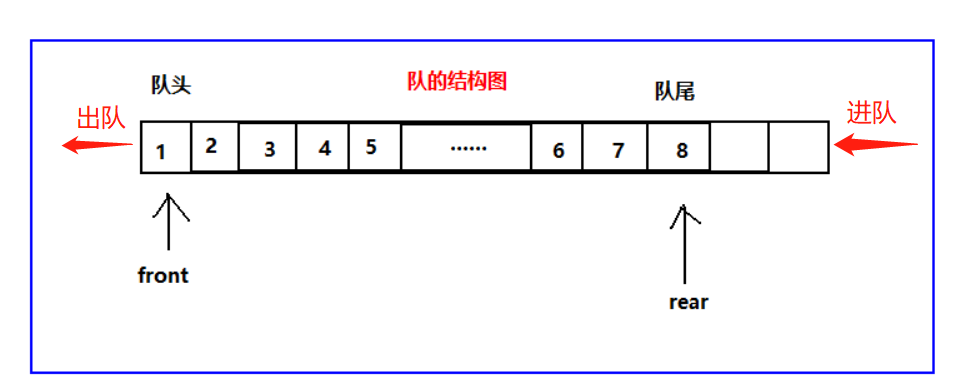

## 什么是队列？

队列是是一种受限的线性表，特点为先进先出（FIFO：first in first out）。

受限之处在于它只允许在表的前端（front）进行删除操作；

在表的后端（rear）进行插入操作；



## 队列的实现方式

1. 基于数组实现；
2. 基于链表实现；

## 队列常见的操作

1. enqueue：向队列尾部添加一个（或多个）新的项；
2. dequeue：移除队列的第一（即排在队列最前面的）项，并返回被移除的元素；
3. front：返回队列中的第一个元素；
4. isEmpty：如果队列中不包含任何元素，返回true，否则返回false；
5. size：返回队列包含的元素个数，与数组的length属性类似；
6. toString：将队列中的内容，转成字符串形式；

## 队列的实现

```js
// 数组方式实现队列
class Queue {
    constructor() {
        this.queue = [];
    }

    enqueue(element) {
        this.queue.push(element)
    }

    dequeue() {
        return this.queue.shift();
    }

    front() {
        return this.queue[0]
    }

    isEmpty() {
        return this.queue.length === 0;
    }

    size() {
        return this.queue.length;
    }

    toString() {
        let str = '';
        for (let item of this.queue) {
            str += item + ' ';
        }
        return str;
    }
}
```

## 优先级队列

1. 每个元素不再只是一个数据，还包含数据的优先级；
2. 在添加数据过程中，根据优先级放入到正确位置；

```js
// 每个元素不再只是一个数据，还包含数据的优先级；
// 在添加数据过程中，根据优先级放入到正确位置；

class QueueElement {
    constructor(element, priority) {
        this.element = element;
        this.priority = priority;
    }
}

class PriorityQueue {
    constructor() {
        this.queue = [];
    }

    enqueue(element, priority) {
        let queueElement = new QueueElement(element, priority);

        // 判断队列是否为空

        if (this.isEmpty()) {
            this.queue.push(queueElement);
        } else {
            let add_flag = false
            for (let i = 0; i < this.queue.length; i++) {
                // priority越小，优先级越大
                if (queueElement.priority < this.queue[i].priority) {
                    this.queue.splice(i, 0, queueElement);
                    add_flag = true
                    // 新元素已经找到插入位置了可以使用break停止循环
                    break;
                }
            }

            if (!add_flag) {
                this.queue.push(queueElement);
            }
        }
    }

    isEmpty() {
        return this.queue.length === 0;
    }

    dequeue() {
        return this.queue.shift();
    }

    front() {
        return this.queue[0]
    }

    isEmpty() {
        return this.queue.length === 0;
    }

    size() {
        return this.queue.length;
    }

    toString() {
        let str = ''
        for (let i of this.queue) {
            str += i.element + '-' + i.priority + ' '
        }
        return str
    }
}

let pq = new PriorityQueue();
pq.enqueue('Tom', 111);
pq.enqueue('Hellen', 200);
pq.enqueue('Mary', 30);
pq.enqueue('Gogo', 27);
```